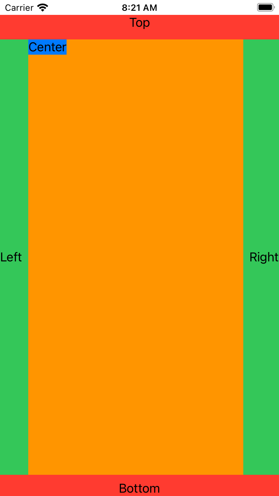

# Collection of SwiftUI apps
This repo contains my version of the apps from Paul Hudson's course 100 days of SwiftUI:
https://www.hackingwithswift.com/100/swiftui

# Catalog

## Accessibility App

### Highlights

* Accessibility elements
* UI elements: `Slider` and `Stepper`

### Demo

***

## Animations

### Highlights
* `Stepper`
* `animation()` function on views
* `AsymmetricView`, `Rectangle` with transition
* `TappingButton` with `animation`, `scaleEffect`, `easeInOut`
* `RectangleDrag` with 3D effect rotation
* `Button` with animation using `interpolatingSpring`
* `SnakeAnimation`
* `DragGesture`
* `RotatingAnimations` with `interpolatingSpring` and 3D effect

### Demos

| Tap Button  | Snake | Rotating Circle | Growing Circle |
| ------------- | ------------- | ------------- | ------------- |
|  |  |  |  |

***

## ArrowChallenge

### Highlights

* Shapes: triangle, rectangle using `Shape` protocol
* `Slider`
* `ColorCyclingRect` and `ColorCyclingCircle` which are custom views
* Drawing gradients: `LinearGradient` and `Gradient`

### Demo

## BetterRest

### Highlights

* `NavigationView` with forms and sections
* `DatePicker`
* `CoreML` models
* Accessibility values to steppers

### Demo

***

## Bookworm

### Highlights

* `CoreData`
* `FetchRequest`
* `List` and `ForEach`
* `NavigationView` with navigation links `NavigationLink`
* `GeometryReader`
* Bindings `@Binding`
* Accessibility support in `RatingView`
* `TextField`, `Picker`, `Gradient`

### Demo

***

## BucketList

### Highlights

* Context authentication, `LAContext` and biometrics
* Loading data with `FileManager`
* Bindings `@Binding`
* `UIViewRepresentable` with `MapKit`
* `ObservableObject`
* Different states of a View with `StateView`
* Lists, forms and sections
* `URLSession` fetch data
* Biometrics

### Demo

***

## ChallengeSeventySix

### Highlights

* `FileManager`
* Alerts and sheets
* `ImagePicker`
* Forms and sections
* `GeometryReader`
* `MapKit`
* `NavigationLink`

### Demo

***

## CoreDataProject

### Highlights

* `CoreData`
* `CustomView` called `FilteredList` - using generics  in `NSFetchRequest`
* `ViewBuilder`

### Demo

***

## CupcakeCorner

### Highlights

* Property wrappers / protocols: `ObservedObject`, `ObservableObject`
* `Form` in `ValidateView`
* `List`
* Network request
* `Form` with `Section`, `Stepper`, `Toggle` and `Picker`
* `NavigationLink`
* `GeometryReader`

### Demo

***

## Drawing

### Highlights

* Using `Circle` in `ZStack`
* Custom shapes

### Demo

***

## Flashzilla

### Highlights

* Full accessibility support
* Using `Timer` with Combine
* `UserDefaults` for storing items
* Haptics with `CHHapticEvent`
* `List`
* `@Binding`

### Demo

***

## FriendFace

### Highlights

* `CoreData`
* `List` inside `NavigationView`
* Network request
* Forms
* `ForEach`

### Demo

***

## GuessTheFlag

### Highlights

* `ClipShape` with `Capsule`
* `ForEach`

### Demo

***

## HabitTracker

### Highlights

* `Form`
* `NavigationView`

### Demo

***

## HotProspects

### Highlights

* `TabView`
* Using environment objects
* `ObservableObject`
* QR Codes
* `NavigationView`
* `List` with `ForEach`
* `DelayedUpdater`
* Multiple custom views
* `UNUserNotificationCenter`

### Demo

***

## iExpense

### Highlights

* `NavigationView`
* `List` with `ForEach`
* `ObservedObject`
* `ViewModifier`

### Demo

***

## InstaFilter

### Highlights

* Custom bindings inside `body`
* Applying filters to an image
* `@Binding`
* `UIViewControllerRepresentable`

### Demo

***

## LayoutAndGeometry

### Highlights

* Using `alignmentGuide`
* `VerticalAlignment`
* `ViewDimensions`
* `GeometryReader`
* `RotationScrollView`
* `HorizontalScrollView`

### Demos

| Alignment Guide | Custom Alignment Guide | Offset Background | OuterInner View | ScrollView | Horizontal Scroll View |
| ------------- | ------------- | ------------- | ------------- | ------------- | ------------- |
|  |  |  |  |  |  |

***

## Moonshoot

### Highlights

* Fun app, astronauts and missions
* `List`
* Encoding and decoding JSONs from `Bundle`
* `NavigationLink`
* `GeometryReader`

### Demo

***

## MultiplicationTable

### Highlights

* `NavigationView`
* `Form` with `Stepper` and `Picker`
* `NavigationLink`
* `LinearGradient`

### Demo

***

## RockScissorsPaper

### Highlights

* `ForEach`

### Demo

***

## RollDice

### Highlights

* `TabView`
* `CHHapticEngine`
* `NavigationView`
* `List` with `ForEach`
* `Form`
* `ObservableObject`

### Demo

***

## SnowSeeker

### Highlights

* `ObservedObject`
* Encoding and decoding JSONs from `Bundle`
* `NavigationView`
* `List`
* `Group`
* Using `layoutPriority` in `SkiDetailView` and `ResortDetailView`

### Demo

***

## SwiftUI17

### Highlights

* `NavigationView`
* `Form` with `Picker`

### Demo

***

## SwiftUI19

### Highlights

* `NavigationView`
* `Form` with `Picker`

### Demo

***

## SwiftUI26

### Highlights

* `Stepper`

### Demo

***

## SwiftUI63CoreImage

### Highlights

* `UIViewControllerRepresentable`
* `CIFilter`

### Demo

***

## ViewsAndModifiers

### Highlights

* `ViewModifier`

### Demo

***

## WorldScrabble

### Highlights

* `NavigationView`
* `List`

### Demo

